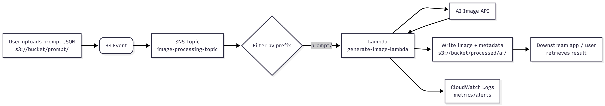

# Cloud5-Serverless-Image-Processing
CS1660 Final Project

## Group Members:
- Chris White
- Mia Miller
- Hao Wang
- Maia Harmon
-

## Project Description

### Serverless Image Processing Service
Develop a web application that allows users to upload and process images.
• Suggested AWS Services: S3, Lambda, API Gateway, DynamoDB, Cognito,
CloudFront, Step Functions
• Users upload images to S3
• AI image service processes images
• Provide downloadable URLs for processed images
• Track processing history per user

## Event-Driven Flow

1. User uploads a JSON prompt to `s3://<bucket>/prompt/`.
2. S3 event triggers SNS topic; SNS routes to `generate-image-lambda`.
3. Lambda parses the prompt, calls the AI image-generation API, stores the resulting image in `processed/ai/`, and logs prompt metadata.
4. Downstream services download the generated image and metadata from S3.

## Implementation Steps

1. **Secrets and IAM Foundation**
   - Store API keys in Secrets Manager (or encrypted environment variables).
   - Update IAM roles/policies so the Lambda can read secrets, write to S3, and publish logs.

2. **Implement AI Image Generation**
   - Build a small module or helper that calls the chosen AI API and returns image bytes or base64.
   - Handle retries, rate limits, and response validation; encapsulate error handling.

3. **Lambda Logic Update**
   - Replace Pillow code with prompt parsing plus AI API invocation logic.
   - Persist generated images and metadata in `processed/ai/`.

4. **Container Packaging and Dependencies**
   - Update the Dockerfile, bundle SDK dependencies, and ensure compatibility with Lambda’s runtime.
   - Rebuild the container image, push it to ECR, and confirm the Lambda picks up new layers.

5. **Event Routing and Permissions**
   - Reconfigure S3 notifications to publish prompt uploads to SNS.
   - Subscribe the new Lambda with the proper filter policy and grant SNS invoke permissions.

6. **Validation and Monitoring**
   - Run the end-to-end test script (e.g., `hack/test-ai.sh`) and manual prompt uploads.
   - Set up log/metric dashboards to watch success rates, latency, and API quota usage.

## Work Allocation (5 Members)

- **M1** — Step 1: Secrets & IAM setup. Short, foundational prep work.
- **M2** — Step 2: Implement the AI image-generation helper module.
- **M3** — Step 3: Refactor the Lambda handler to use the new AI module.
- **M4** — Step 4: Update the container/Dockerfile, manage dependencies, push to ECR.
- **M5** — Steps 5–6: Rewire S3/SNS permissions and own validation/monitoring rollout.

## Work Flow

## TODO
- Create S3 Buckets for image uploads
- Set up authentication layer with Cognito(?)
- - Create an account and log in
- - Alter the state of the application (e.g., save preferences, create content)
- - Log out and log back in to see their persisted data
- Set up API Gateway
- - I think making the images downloadable is part of this
- Set up Lambda Functions for image processing
- Set up DynamoDB
- Set up CloudFront
- Step Functions
